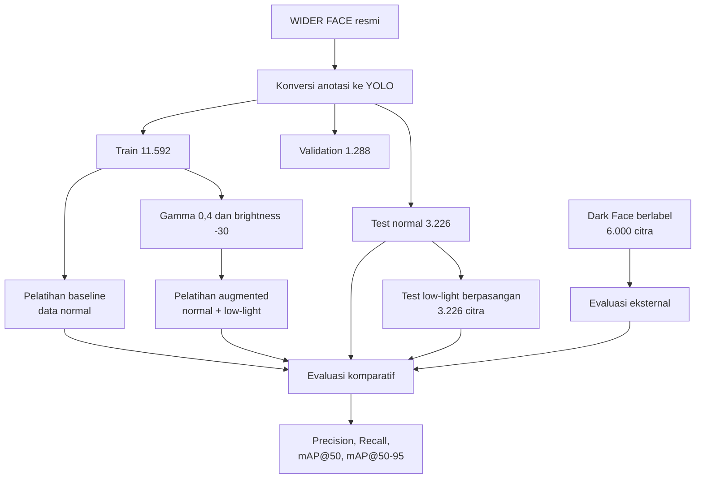

# Analisis Robustness Deteksi Wajah pada Kondisi Pencahayaan Rendah Menggunakan Data Augmentation dan YOLOv8n

> **Status judul:** judul di atas masih mengikuti naskah skripsi saat ini. Usulan revisi yang belum ditetapkan adalah **“Analisis Pengaruh Augmentasi Low-Light terhadap Kinerja Deteksi Wajah Menggunakan YOLOv8n.”**

Repositori ini berisi implementasi penelitian skripsi yang membandingkan dua skenario pelatihan deteksi wajah berbasis **YOLOv8n**:

1. **Baseline** — dilatih menggunakan citra WIDER FACE normal.
2. **Augmented** — dilatih menggunakan citra normal dan salinan sintetis *low-light*.

Fokus penelitian adalah **menganalisis pengaruh penambahan augmentasi low-light**, bukan menyatakan bahwa model sudah robust untuk seluruh kondisi dunia nyata. Evaluasi dilakukan pada data normal, data *low-light* sintetis berpasangan, dan Dark Face sebagai data eksternal.

## Ringkasan eksperimen

| Komponen | Konfigurasi |
|---|---|
| Model | YOLOv8n (*pretrained*) |
| Resolusi masukan | 640 × 640 piksel |
| Epoch | 50 |
| Batch size | 16 |
| Seed pembagian data | 42 |
| Seed pelatihan | 0, deterministic |
| Transformasi khusus | Gamma 0,4 dan brightness -30 |
| Metrik utama | Precision, Recall, mAP@50, dan mAP@50–95 |

Transformasi *low-light* bersifat fotometrik, sehingga koordinat *bounding box* tidak berubah. Nilai gamma dan brightness dibuat tetap untuk membentuk degradasi terkontrol yang sama pada skenario pelatihan dan pengujian sintetis.

## Protokol data

WIDER FACE menggunakan pembagian resmi `12.880 train / 3.226 validation / 16.097 test`. Karena anotasi *ground truth* untuk official test tidak tersedia secara publik, eksperimen lokal menggunakan protokol berikut:

| Split eksperimen | Sumber | Jumlah citra | Kegunaan |
|---|---|---:|---|
| Train | 90% official WIDER train | 11.592 | Pelatihan model |
| Validation | 10% official WIDER train | 1.288 | Pemilihan model selama pelatihan |
| Test normal | Official WIDER validation | 3.226 | Evaluasi *held-out* kondisi normal |
| Test low-light | Salinan berpasangan dari test normal | 3.226 | Evaluasi degradasi sintetis terkontrol |
| Dark Face eksternal | Citra berlabel dari sumber Dark Face | 6.000 | Evaluasi generalisasi lintas dataset |

Skenario augmented berisi `11.592` citra normal dan `11.592` citra *low-light*, sehingga total data latihnya `23.184` citra. Split test tidak pernah dimasukkan ke data pelatihan. Script audit memeriksa jumlah data, pasangan label, tumpang tindih split, dan kemungkinan augmentasi bertingkat.

## Alur penelitian



## Hasil eksperimen

Hasil berikut berasal dari artefak eksperimen final yang tersimpan secara lokal. Bobot model dan hasil lengkap tidak dimasukkan ke Git karena ukurannya besar.

| Model dan kondisi uji | Precision | Recall | mAP@50 | mAP@50–95 |
|---|---:|---:|---:|---:|
| Baseline — normal | 0,84348 | 0,58709 | 0,67048 | 0,36184 |
| Augmented — normal | 0,84911 | 0,59296 | 0,67617 | 0,36570 |
| Baseline — low-light sintetis | 0,76365 | 0,38215 | 0,45046 | 0,23480 |
| Augmented — low-light sintetis | 0,80334 | 0,47994 | 0,55410 | 0,29627 |
| Baseline — Dark Face eksternal | 0,49651 | 0,19154 | 0,20181 | 0,05872 |
| Augmented — Dark Face eksternal | 0,53914 | 0,24460 | 0,26030 | 0,07792 |

Pada uji sintetis, penurunan relatif mAP@50 dari kondisi normal ke *low-light* berkurang dari **32,82%** pada baseline menjadi **18,05%** pada model augmented. Pada Dark Face, model augmented juga lebih baik secara relatif, tetapi mAP@50 sebesar `0,26030` masih menunjukkan keterbatasan generalisasi pada kondisi gelap nyata.

## Struktur repositori

```text
.
├── README.md                  # Dokumentasi utama repositori
├── project_config.py         # Path, split, nama run, dan parameter eksperimen
├── requirements.txt          # Dependensi Python
├── configs/                  # Konfigurasi dataset untuk Ultralytics YOLO
│   ├── wider_face_baseline.yaml
│   ├── wider_face_augmented.yaml
│   └── darkface_eval.yaml
└── scripts/
    ├── __init__.py
    ├── *_01.py ... *_16.py   # Pipeline aktif sesuai urutan pengerjaan
    └── legacy/               # Script lama untuk keterlacakan, tidak dipakai final
```

Direktori `datasets/`, `models/`, `runs/`, dan `evaluation_results/` dibuat atau diisi secara lokal dan tidak diunggah ke GitHub. Dokumen skripsi juga tidak disertakan dalam repositori publik.

## Daftar source code aktif

| No. | File | Fungsi |
|---:|---|---|
| 01 | `download_raw_datasets_01.py` | Mengunduh citra WIDER FACE, anotasi resmi dari mirror, dan Dark Face mentah. |
| 02 | `convert_wider_to_yolo_02.py` | Mengonversi anotasi WIDER FACE ke format label YOLO. |
| 03 | `organize_yolo_03.py` | Utilitas alternatif untuk dataset yang sudah memiliki label dan split YOLO; bukan jalur utama data resmi. |
| 04 | `prepare_wider_protocol_04.py` | Membentuk train 90%, validation 10%, dan held-out test sesuai protokol final. |
| 05 | `augment_data_helper_05.py` | Fungsi inti transformasi gamma correction dan brightness. |
| 06 | `generate_lowlight_val_06.py` | Membuat test low-light berpasangan dari test normal. |
| 07 | `batch_augment_07.py` | Membuat dataset latih augmented dari data train saja. |
| 08 | `prepare_darkface_external_08.py` | Menyiapkan 6.000 citra Dark Face berlabel sebagai evaluasi eksternal. |
| 09 | `audit_dataset_09.py` | Memvalidasi jumlah data, label, split, dan mencegah *data leakage*. |
| 10 | `train_baseline_10.py` | Melatih YOLOv8n pada data normal. |
| 11 | `train_augmented_11.py` | Melatih YOLOv8n pada gabungan data normal dan low-light. |
| 12 | `evaluate_robustness_12.py` | Mengevaluasi kedua model pada seluruh skenario uji. |
| 13 | `generate_report_13.py` | Menghasilkan tabel, grafik, dan ringkasan hasil evaluasi. |
| 14 | `camera_demo_14.py` | Demo kualitatif inferensi kamera baseline vs augmented. |
| 15 | `generate_lampiran2_15.py` | Membantu menghasilkan materi Lampiran 2. |
| 16 | `generate_lampiran4_16.py` | Membantu menghasilkan materi Lampiran 4. |

## Instalasi

Jalankan seluruh perintah dari **root proyek**, bukan dari dalam folder `scripts`.

```powershell
python -m venv .venv
.\.venv\Scripts\Activate.ps1
python -m pip install --upgrade pip
pip install -r requirements.txt
```

Versi Ultralytics dikunci ke `8.4.14`, sesuai metadata artefak eksperimen final. Proyek dikembangkan menggunakan Python 3.12. Pelatihan dan evaluasi final menggunakan GPU pada `device=0`; ubah `device` di `project_config.py` jika menjalankan pada perangkat lain.

Siapkan juga:

- kredensial Kaggle untuk pengunduhan Dark Face dan mirror anotasi WIDER;
- bobot awal YOLOv8n di `models/yolov8n.pt` sebelum pelatihan;
- ruang penyimpanan yang memadai karena dataset dan hasil pelatihan tidak disimpan di Git.

## Menjalankan pipeline dari awal

Opsi `--clear` menghapus target tahap terkait sebelum dibuat ulang. Hilangkan opsi tersebut jika data lama perlu dipertahankan.

### 1. Unduh dan konversi dataset

```powershell
python -m scripts.download_raw_datasets_01 --dataset all --clear
python -m scripts.convert_wider_to_yolo_02 --clear
```

### 2. Bentuk protokol WIDER FACE

```powershell
python -m scripts.prepare_wider_protocol_04 --clear
```

### 3. Buat data low-light sintetis

```powershell
python -m scripts.generate_lowlight_val_06 --clear
python -m scripts.batch_augment_07 --clear
```

### 4. Siapkan evaluasi eksternal Dark Face

```powershell
python -m scripts.prepare_darkface_external_08 --clear
```

### 5. Audit dataset sebelum pelatihan

```powershell
python -m scripts.audit_dataset_09 --require-darkface
```

Pipeline harus berhenti apabila ditemukan jumlah yang tidak sesuai, label hilang, tumpang tindih data, atau struktur dataset yang tidak valid.

### 6. Latih kedua model

```powershell
python -m scripts.train_baseline_10
python -m scripts.train_augmented_11
```

Bobot final yang digunakan evaluasi diharapkan berada di:

```text
runs/detect/yolov8n_baseline_clean3/weights/best.pt
runs/detect/yolov8n_augmented_clean/weights/best.pt
```

### 7. Evaluasi dan buat laporan

```powershell
python -m scripts.evaluate_robustness_12
python -m scripts.generate_report_13
```

Ringkasan metrik disimpan di `evaluation_results/robustness_results.csv`; visualisasi dan keluaran validasi berada di direktori yang sama.

## Demo kamera

Demo kamera membandingkan inferensi kedua model pada frame yang sama. Demo ini bersifat **kualitatif** dan bukan sumber nilai akurasi penelitian.

```powershell
python -m scripts.camera_demo_14
```

Kontrol utama:

| Tombol | Fungsi |
|---|---|
| `0`–`4` | Memilih tingkat simulasi pencahayaan |
| `F` | Membekukan atau melanjutkan frame |
| `S` | Menyimpan tangkapan layar |
| `Q` atau `Esc` | Keluar dari demo |

Jangan menjalankan `python camera_demo_14.py` dari root karena file berada di dalam package `scripts`. Bentuk `python -m scripts.camera_demo_14` juga memastikan import `project_config.py` dapat ditemukan.

## Catatan interpretasi dan keterbatasan

- Augmentasi final hanya memodelkan penurunan pencahayaan melalui gamma dan brightness tetap. Noise sensor, blur, perubahan warna, kompresi, dan variasi level kegelapan belum dimodelkan secara eksplisit.
- Uji sintetis memakai transformasi yang sama dengan data augmentasi latih. Karena itu, hasilnya menunjukkan ketahanan terhadap degradasi terkontrol yang cocok, bukan bukti generalisasi universal.
- Dark Face dipakai sebagai **evaluasi eksternal 6.000 citra berlabel**, bukan disebut sebagai official test split 4.000 citra.
- Eksperimen final terdiri dari satu run lengkap per skenario. Belum ada pengulangan multi-seed atau interval kepercayaan.
- Kedua skenario masih menggunakan augmentasi bawaan Ultralytics yang sama. Istilah baseline berarti tanpa **tambahan dataset low-light**, bukan tanpa augmentasi bawaan sama sekali.
- `optimizer="auto"` dapat memilih optimizer berbeda berdasarkan jumlah iterasi dataset. Oleh sebab itu, hasil saat ini paling tepat dibaca sebagai perbandingan dua skenario pipeline, belum sebagai estimasi kausal murni dari satu variabel augmentasi.
- Evaluasi utama belum memisahkan AP berdasarkan ukuran wajah kecil, sedang, dan besar. Precision sudah mencerminkan pengaruh *false positive*, tetapi jumlah dan tipe *false positive* belum dianalisis terpisah.

## Keterlacakan

Semua parameter bersama berada di `project_config.py`, sedangkan YAML dataset berada di `configs/`. Script dalam `scripts/legacy/` dipertahankan hanya sebagai riwayat pengembangan dan **tidak digunakan** untuk menghasilkan metrik final pada README ini.
